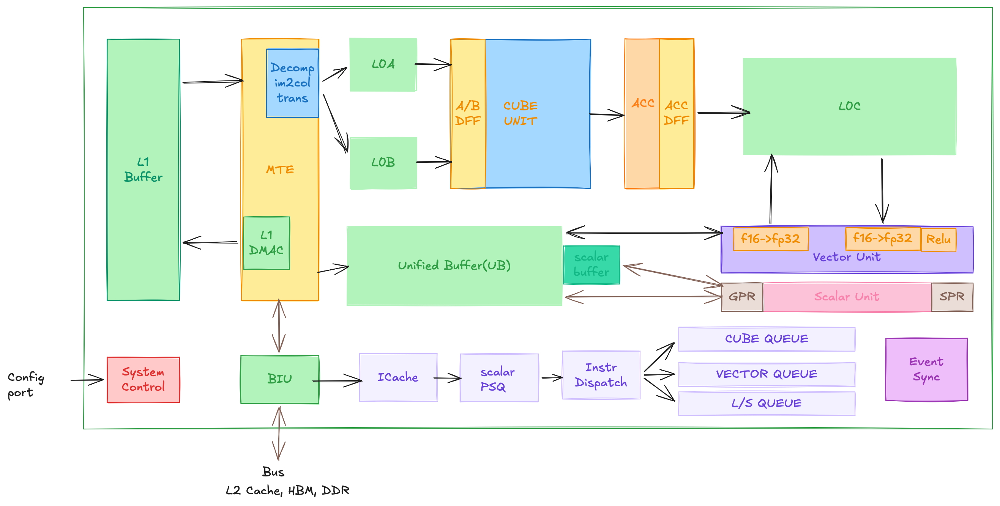
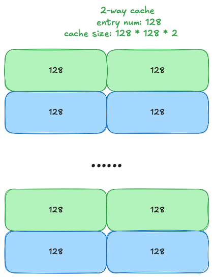
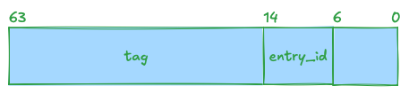
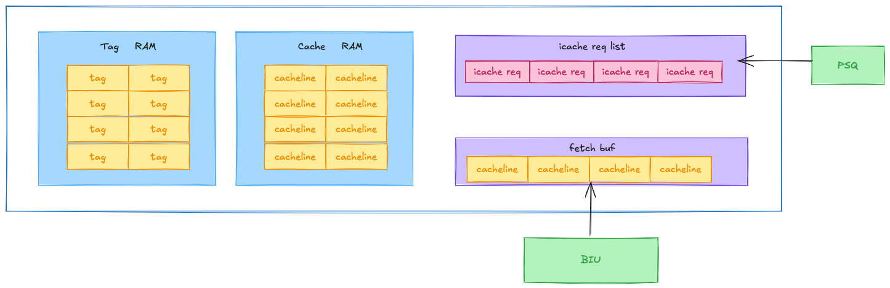

+++
date = '2025-08-19T22:40:35+08:00'
draft = false
title = 'Ascend NPU底层分析1——iCache'
tags = ['NPU']
series=["Ascend NPU底层分析"]
series_order=0
+++
在这个系列里，我将分析Ascend（昇腾）NPU的结构，作为我在昇腾硬件上编程的总结。本篇是第一篇，Cache，也就是缓存，大多数讲NPU架构的文章都会直接忽略掉它，但在高性能编程领域，cache又不可不察也。
<!--more-->

## 1. iCache
Ascend NPU 真正的算力担当是采用了达芬奇架构的 AI Core:

`iCache`，即指令缓存。当算子在NPU device上启动时，算子的指令保存在`HBM`上，PSQ取值单元发送请求到iCache 获取指令以执行，此时，指令从HBM加载到iCache中缓存。
+ Cacheline： 缓存行，iCache的基本单元，一般为128字节。
+ Entry：\(N\)个cacheline组成一个`Entry`，称为`N-way iCache`，\(N\)一般为2。
### 1.1 Cache RAM
iCache 中用来缓存指令的存储单元称为`Cache RAM`。可以把`Cache RAM`看成一个哈希表：

### 1.2 iCache 查询
给定一个PC地址，如何在iCache中查询呢？如上，Cache RAM作为一个哈希表，entry就是哈希桶，cacheline就是具体点cache item。以PC地址的7-13位作为entry的索引，7bit正好可以表示128个entry。以PC地址的14-63位作为`tag`，在确认entry的索引后，遍历entry中的每个cacheline并比较它们的tag，tag相等则缓存命中（hit）。

### 1.3 iCache单元
iCache 单元组成如下：

+ **tag RAM:** 保存cache ram中每个cacheline的tag和lru，与cacheline一一对应
+ **cache RAM：** iCache数据，每个cacheline就是一个128字节的SRAM，里面保存着指令数据
+ **iCache req list：** 接收来自`PSQ`和`HWTS`的iCache请求，先进先出。
+ **fetch buf：**与BIU交互，保存从HBM读取的指令数据，最大4个cacheline，如果fetch buf用完，就不能向BIU提交读请求了。读完成后将fetch buf中的数据拷贝到对应的cache RAM中的cache line中。
### 1.4 iCache 请求
一共有三种类型的iCache 请求，优先级从低到高如下：
1. **PRELOAD：** 只会在kernel执行开始时由hwts下发执行一次，用于指令预取，默认预取32个cacheline。
2. **PREFETCH：** 与PRELOAD类似，预取指令，但由icache单元内部下发，每次预取3个cacheline。
3. **READ：** 由PSQ下发，一次取16个字节的指令字节流，也就是4个指令。
### 1.5 请求状态机
一次请求的状态有五种：
1. **IDLE：** 请求的初始状态。
2. **HIT：** 每个tick会选择一个IDLE的请求，查询tag是否命中，命中则状态转移为HIT。
3. **MISS: tag** 不命中则状态转移为MISS。
4. **FETCHING：** 每个tick会选择一个MISS的请求，此时有两种情况：
	- 若请求队列中已经存在一个相同地址的`FETCHING`
    请求，则复用该请求，状态迁移为`FETCHING`。
	- 通过BIU下发HBM的读请求，状态迁移为`FETCHING`。
5. **COMPLETED：** 每个tick会选择一个`FETCHING`状态并且BIU读完成的请求，状态迁移为`COMPLETED`。同时：
	- 请求队列中所有相同地址的MISS请求的状态也会直接迁移为`COMPLETED`。
	- 请求队列中所有BIU请求ID相同的`FETCHING`请求的状态也会直接迁移为`COMPLETED`，对应4中的请求复用场景。

stateDiagram-v2
IDLE --> HIT
IDLE --> MISS
MISS --> FETCHING
FETCHING --> COMPLETED
MISS --> COMPLETED
HIT --> COMPLETED


### 1.6 iCache 单元工作流程
iCache单元每个tick的工作流程如下：
+ 检查请求队列中`FETCHING`状态的请求是否读取完成，如果读取完成，将请求状态置为`COMPLETED`、井将fetch buf中的数据拷贝到cache RAM中。同时请求队列中地址相同但状态为MISS的请求状态也会被置为`COMPLETED`；相同BIU请求ID状态为`FETCHING`的请求状态置为`COMPLETED`。
+ 将`COMPLETED`状态的请求从请求队列中清除。
+ 如果fetch buf空闹，就从请求队列中取一个优先级最高的MIISS状态的请求，向BIU提交一个读请求（如果请求可以复用就不用重复提交）。
+ 从请求队列中取一个类型为READ且状态为HIT的请求，将对应cacheline中的数据拷贝到请求的dest buf 中，并将请求状态置为`COMPLETED`。
- 从请求队列中取一个优先级最高的IDLE状态的请求、查询iCache，查询结果有以下几种情况：  
	||HIT|MISS|
	|---|---|---|
	|READ|更新对应tag的lru|提交3个PRETCH请求到队列|
	|PREFETCH|请求状态置为COMPLETED|/|
	|PRELOAD|请求状态置为COMPLETED|/|
