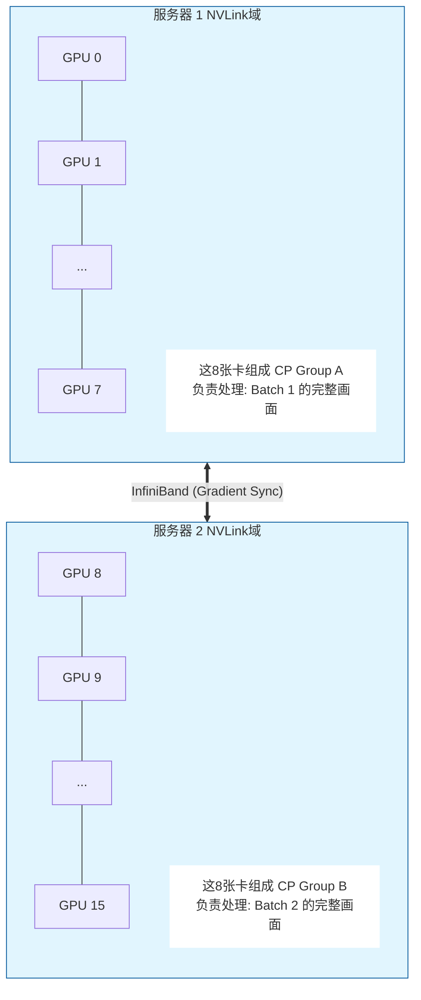

+++
date = '2026-01-04T16:18:00+08:00'
draft = false
title = 'LongCat-Video 笔记'
categories = ['Programming']
tags = ['LLM']
math = true
toc = true
+++
LongCat-Video 模型是美团开源的一款长上下文视频生成模型。本文为该模型代码的阅读笔记。
<!--more-->
[LongCat-Video](https://github.com/meituan-longcat/LongCat-Video) 的架构如下：
在正式深入DiT架构前，我们先看一下它是如何处理prompt，生成输入的工程开启了`DP`和`CP`。

。
## 文本Prompt 编码
